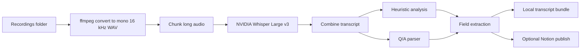

# Transcription Organizer Pipeline

A local-first pipeline for turning customer interview recordings into usable artifacts:

- `transcript.txt`
- `analysis.md`
- `analysis.json`
- `qa_pairs.json`
- `field_extraction.json`
- `chunk_metadata.json`

It watches a recordings folder, converts media to a transcription-safe WAV format, runs NVIDIA Whisper Large v3, applies deterministic interview analysis, extracts structured fields, and optionally publishes the result into a Notion database.

## Why This Exists

Customer interviews are only useful if they become searchable decisions instead of dead recordings.

This repo is for the middle layer between raw calls and product learning:

- ingest local recordings
- normalize audio with `ffmpeg`
- transcribe long files in chunks
- reconstruct one clean transcript
- split interview Q/A pairs
- extract structured signals like pricing, confusion, tool spend, follow-up interest, and product feedback
- optionally push the output into Notion

It is intentionally not a generic agent framework and not a paid-LLM analysis stack.

## Scope

- local folder watcher for new recordings
- NVIDIA transcription only
- deterministic heuristic analysis only
- optional Notion publishing
- shell scripts for replaying and test-driving the pipeline
- macOS LaunchAgent template for background execution

Out of scope:

- hosted LLM analysis
- cloud storage ingestion
- speaker diarization
- browser dashboards
- hidden product-specific logic

## Pipeline



## See It Work

The repository includes a safe, fake sample bundle so the transformation is inspectable without credentials or real recordings:

```bash
./scripts/test_no_paid_ai.sh
./scripts/test_field_extraction.sh
./scripts/test_notion_property_formatting.sh
```

Then open the generated files in `tests/output/` or compare them with the committed [sample bundle](./examples/sample_bundle/). The tests keep this local replay path separate from the optional NVIDIA and Notion integrations.

## Quick Start

### 1. Install dependencies

```bash
brew install ffmpeg
python3 -m venv .venv
source .venv/bin/activate
pip install -r requirements.txt
```

### 2. Configure environment

```bash
cp .env.example .env
```

Minimum required values:

- `NVCF_API_KEY`
- `NVCF_FUNCTION_ID`

Set `ENABLE_NOTION=true` only if you also provide:

- `NOTION_API_KEY`
- `NOTION_DATABASE_ID`

### 3. Run once in the foreground

```bash
python -m transcription_service --base-dir .
```

### 4. Drop a recording into `Recordings/`

Supported extensions include `.mp3`, `.mp4`, `.m4a`, `.mov`, `.wav`, `.ogg`, and `.webm`.

The pipeline will create a transcript bundle under `Transcripts/`.

## Optional Background Run

If you want the service to stay alive between sessions on macOS:

```bash
./scripts/install_launchagent.sh
```

This script fills in the placeholder path inside [launchd/com.customer-interview.transcription.plist.example](./launchd/com.customer-interview.transcription.plist.example) and installs a user LaunchAgent.

Remove it later with:

```bash
./scripts/uninstall_launchagent.sh
```

## Example Artifact

Safe fake sample bundle:

- [examples/sample_bundle/transcript.txt](./examples/sample_bundle/transcript.txt)
- [examples/sample_bundle/analysis.md](./examples/sample_bundle/analysis.md)
- [examples/sample_bundle/analysis.json](./examples/sample_bundle/analysis.json)
- [examples/sample_bundle/qa_pairs.json](./examples/sample_bundle/qa_pairs.json)
- [examples/sample_bundle/field_extraction.json](./examples/sample_bundle/field_extraction.json)
- [examples/sample_bundle/chunk_metadata.json](./examples/sample_bundle/chunk_metadata.json)

Example structured output:

```json
{
  "Expected Price": "$39/month",
  "Monthly Tool Spend": "$12/month\n$20/month",
  "Did They Understand The Tool Quickly?": "Confused",
  "Follow-Up Booked?": true
}
```

## Test Scripts

Run local checks:

```bash
./scripts/test_no_paid_ai.sh
./scripts/test_field_extraction.sh
./scripts/test_notion_property_formatting.sh
```

What these prove:

- heuristic analysis runs without paid LLM APIs
- willingness-to-pay stays separate from current tool spend
- Q/A parsing emits structured pairs
- field extraction produces JSON artifacts
- Notion property formatting stays stable for supported field types

## Replay Existing Transcript Bundles

If you want to regenerate analysis and extraction for the latest saved transcript without retranscribing:

```bash
./scripts/reprocess_latest_transcript.sh
```

With `ENABLE_NOTION=false`, this only rewrites local artifacts.

## Project Layout

```text
transcription-organizer-pipeline/
├── .env.example
├── README.md
├── requirements.txt
├── launchd/
│   └── com.customer-interview.transcription.plist.example
├── scripts/
│   ├── install_launchagent.sh
│   ├── print_notion_schema.sh
│   ├── reprocess_latest_transcript.sh
│   ├── run_service.sh
│   ├── test_field_extraction.sh
│   ├── test_no_paid_ai.sh
│   ├── test_notion_property_formatting.sh
│   └── uninstall_launchagent.sh
├── examples/
│   └── sample_bundle/
├── tests/
│   ├── sample_interview_confusion.txt
│   ├── sample_interview_current_spend.txt
│   ├── sample_interview_pricing.txt
│   └── sample_transcript.txt
└── transcription_service/
    ├── analysis.py
    ├── audio.py
    ├── config.py
    ├── field_extractor.py
    ├── field_question_map.py
    ├── interview_parser.py
    ├── main.py
    ├── notion_fields.py
    ├── notion_integration.py
    ├── nvidia_client.py
    ├── store.py
    └── watcher.py
```

## Security And Publication Notes

- This public repo contains no real recordings, transcripts, logs, database IDs, or internal prompts.
- `.env` is ignored. `.env.example` contains placeholders only.
- The pipeline blocks common paid-LLM environment variables on startup.
- Notion publishing is optional and disabled by default.
- The repo does not ship any product-specific interview schema beyond generic customer-learning fields.

## Current Limitations

- macOS background automation is provided through `launchd`; other OS schedulers are not included.
- Analysis is heuristic, not semantic. It will miss nuance and should be reviewed by a human.
- The pipeline does not repair corrupted media files.
- Notion support assumes a database schema that is close to the included generic field model.
- There is no diarization or speaker-label recovery.
